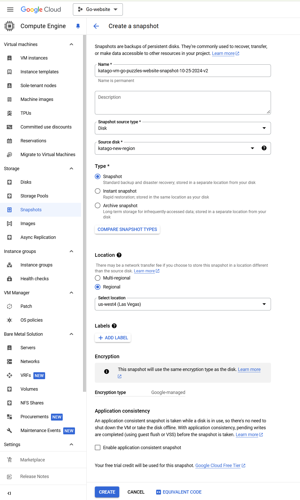
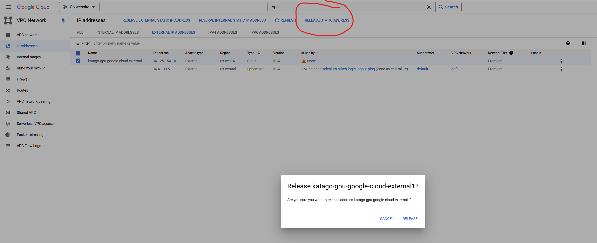

Since my unused GCP vm is charging me around $7 a month, and I haven't had this VM with my KataGo GPU on it run for like 6 months now, I want to save money by making a snapshot of the VM in case I want to restore it later, and then delete the vm.  To do this, I did the following steps:

1. Make sure the VM is off.  Navigate to "VM instances" in the left panel, or using the search field at the top, then stopping it.  

2. In the left panel, go to "Storage" -> "Snapshots" -> "Create Snapshot"

3. Give a name, description (optional), Snapshot source type should be "Disk"

Select your VM from the "Source Disk" dropdown menu

For Type choose Snapshot

For Location change it to regional (it should auto select the location of the vm)

Do NOT check the "Enable application consistent snapshot" button at the bottom

Finally, click "Create", it'll take a few minutes to create the snapshot!

4. To delete the vm, simply search for "Vm instances", then select the VM, then click "Delete" in the top panel.

5. Now search for VPC networks in the search field, look for the external ip address that's no longer in use, and click the "Release static address" (2nd image below)

